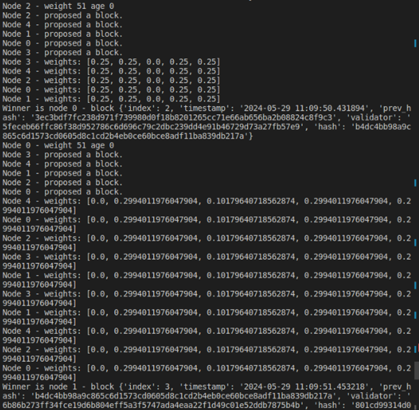

# Proof-of-Work vs Proof-of-Stake 

## Introduction 

A blockchain is a distributed database in which a record of transactions, especially those made in a cryptocurrency, is maintained across computers that are linked in a peer-to-peer network. Once a record enters the database, it cannot be changed without the consent of all other  network  users  thanks  to  distributed  consensus  processes,  digital  signatures,  and cryptographic hash functions. Because of this, information recorded on a blockchain may be traditionally validated even in a decentralized setting, opening up a wide range of blockchain applications. 

Because blockchains are decentralized, no one entity is in charge of the network. Consensus procedures make sure that everyone is in agreement with the ledger's current state, which is an account of every transaction. Conflicting accounts of the truth would exist in the absence of consensus, making the system untrustworthy. 

The two most common consensus algorithms are Proof-of-Work (PoW) and Proof-of- Stake (PoS). The PoW implementation of this project will aim to replicate a multi-node blockchain network using a Byzantine fault-tolerant consensus mechanism. The application shows how a decentralized network with nodes that take part in block mining, block validation, and consensus-building on the state of the blockchain operates. Byzantine nodes, which have the ability to act deliberately and attempt to thwart the consensus process, are included in the simulation.  PoS is the more energy-efficient alternative to PoW. In this algorithm, validators are chosen based on the amount of cryptocurrency they hold (their stake) in the network. The purpose of the implementation of PoS in this project is to simulate a distributed ledger of transactions, which is a characteristic feature of blockchain technology. 

## State of the Art 

Proof of Work, or PoW, is an established technology that continues to be the algorithm behind industry titans like Bitcoin [1]. The complexity of the mining tasks, which uses a lot of power, is a major factor in PoW security. One of the main complaints of PoW is its excessive energy usage. Alternative hashing algorithms that require less processing power to solve are actively being investigated in order to lower the total energy footprint [2]. Furthermore, some miners are reducing their environmental effect by using renewable energy sources. To keep the block creation rate at the targeted level, the difficulty is continuously changed. In order to provide the best possible security, sophisticated methods are being developed to dynamically modify complexity depending on network circumstances [3]. 

The well-established Proof of Work (PoW) consensus process used in blockchains is being challenged by Proof of Stake (PoS) first introduced in a paper by Sunny King and Scott Nadal in 2012 and intended to solve the problem of Bitcoin mining's high energy consumption [4]. In contrast to PoW, where miners compete with one another for processing power, PoS uses validators chosen according to their level of currency ownership. A validator's chances of being selected to validate new blocks and get rewards increase with the amount of stake they possess. Validators are encouraged by this system to behave honorably because trying to alter the blockchain might result in their stake being lost. PoS uses significantly less energy than PoW's resource-intensive mining. Block validation proceeds more quickly, which speeds up the network's transaction processing times and can be more easily scaled to accommodate increased transaction volume without sacrificing security [5].  

Several digital currencies, such as Ethereum, Peercoin, Cardano, or Polkadot, are now using proof of stake consensus in one way or another. Nevertheless, there are significant security risks associated with pure proof of stake techniques that are not present in proof of work systems like Bitcoin. Since proof of stake consensus is not grounded in reality, these issues are intrinsic to proof of stake algorithms. Because of this, almost every cryptocurrency that uses proof of stake also employs extra security measures. 

Although PoS provides strong security, the technology is still in its early stages. PoW has an advantage here due to its proven track record. Ongoing PoS research, however, is constantly  enhancing  its  security  characteristics.  Distributing  power  more  fairly  across validators is a continuous area of research, however Delegated PoS addresses the centralization problems in PoS. On the other hand, because mining involves open involvement, PoW has the potential to be more decentralized than PoS altervatives. 

## Implementation 

Github link: https://github.com/adiclapa/pow-vs-pos 

### Proof of Work 

In the *main* function of *pow.py*, the number of nodes, Byzantine node probability, and mining difficulty are determined. A shared list of nodes, which serves as a blockchain, is created and synchronization methods are shared among nodes. *PowNode* objects with their respective properties are initialized and added to the node list. Each node is a separate process that begins the mining process. The main mining loop is where nodes create and broadcast new blocks. Random transactions are generated and used to mine new blocks. To mine a new block, a node needs to find a hash that begins with the number of zeros specified by the difficulty. 

The node mines a new block by finding a nonce that satisfies the difficulty requirement, the hash over the Merkle root hash, nonce, and the current block to start with a number of 5 zeros  in  this  case.  The  Merkle  root  of  the  transactions  is  calculated;  if  the  number  of transactions is not even, the last one is duplicated. The difficulty can be adjusted at the start of the blockchain. If a node finds a nonce that satisfies the requirements, it broadcasts the new block and every node votes on accepting or rejecting the block (if the block is correct, all honest nodes will accept it). Byzantine nodes will broadcast blocks that do not satisfy the requirements and if the majority of nodes are Byzantine, this block will be added to the blockchain. 


Figure 1 - Sequence diagram of the PoW implementation. 

### Proof of Steak 

The *PosNode* class is used to generate nodes in the blockchain, which have certain features  (index,  byzantine  probability,  initial  weight,  and  initial  age).  Depending  on  the specified probability, every node can be either honest or byzantine. Every node maintains a common blockchain, a shared list of blocks. Every node submits a new proposed block to be added to the blockchain during a consensus epoch, and these proposals are kept on a shared list known  as  proposed  blocks.  Additionally,  concurrent  operations  are  managed  using synchronization primitives, sometimes known as barriers. 

The Proof of Stake (PoS) consensus process is utilized by nodes. Nodes update the blockchain, add new blocks, and validate other people's proposed blocks. Honest nodes are trying to preserve the blockchain's integrity by checking the blockchain before adding their block, while byzantine nodes may try to sabotage the operation by proposing invalid blocks and not verifying the blockchain. For a block to be valid it needs to contain the hash of the previous block and a valid hash of the current block. The consensus algorithm it's designed to incorporate the participation of multiple nodes in the PoS consensus algorithm, effectively demonstrating the interactions between honest and Byzantine nodes within such a system. During every consensus epoch, each node adds their own version of the new block which they propose to be added to the blockchain. This democratic approach allows for a variety of options which are then considered in the following step. Subsequently, every node gets a chance to select a winning block. This selection process isn't arbitrary, but rather involves making a random choice that incorporates certain weights. These weights have a crucial role in the random selection process, ensuring that the process is not purely chance-based but also respects the  contribution  of  each  node.  This  weight  is  calculated  as  follows  for  every  node: *node\_stake=node\_weight\*node\_age*  and  its  change  to  get  elected  is *final\_weight=total\_stake/node\_stake.* 

In an effort to prevent monopolization of block addition, the node that added the previous block in the blockchain is given zero chance to add a new block in the current epoch (its final weight is set to 0 for that epoch). This rule ensures that no single node has excessive influence over the progression of the blockchain. Furthermore, there are strict penalties in place to maintain the integrity of the blockchain. For instance, if a node adds a block that doesn't meet the blockchain's requirements, it faces the consequence of being penalized. Such a node is excluded from participating in the consensus process for the next 10 rounds and its block is removed from the blockchain. To add a sense of balance in this process, one more rule is implemented. The more a node participates in the consensus process without successfully adding a block (the node age from the above formula), the higher the chance for that node to be chosen as the winner of that epoch. This encourages participation and keeps nodes engaged in the process, creating a healthy environment. 

## Testing 

### Proof of Work 

#### Majority of the nodes honest 

In this case the process is not disrupted by the byzantine node and the final blockchain is correct integrally (fig. 2-4).  


Figure 2 - Execution time for mining 10 blocks with all honest nodes.


Figure 3 - PoW testing with honest nodes. 


Figure 4 - PoW testing final blockchain with honest nodes. 

As a result all blocks are valid and the limit a byzantine node to add a block in the blockchain is the number of byzantine nodes to be at least equal or greater than the number of honest nodes. 

#### Majority of the nodes byzantine 

As we can see from fig.2 and 5 the execution time is a lot lower for a larger number of byzantine nodes because the avoid the mining process by generating invalid nodes. 


Figure 5 - Execution time for mining 10 blocks with 3 out of 5 byzantine nodes.


*Figure 6 - PoW testing with byzantine nodes.* 


Figure 7 - PoW final blockchain with byzantine nodes. 


Figure 8 - PoS testing with majority honest nodes.

### Proof of Steak 

#### Majority of the nodes honest 

As we can see (fig. 8-10), the consensus process in this case operates effectively, with little interference from the byzantine node. It was not even given the opportunity to add one of its blocks in this instance.



Figure 9 - PoS testing with majority honest nodes.


Figure 10 - PoS final blockchain for majority honest nodes. 

In this version every block contains the correct *prev\_hash* corresponding to the *hash* of the previous block. 

#### Majority of the nodes byzantine 

By having the majority of the nodes byzantine the process of choosing a new block takes more time but in the first epoch a byzantine node adds its block to the blockchain. A few more blocks are added by byzantine nodes until one honest node adds its block and makes the necessary checks on the chain. In that moments the byzantine nodes are penalized and cannot participate in the next epochs of the consensus. 

This scenario shows how invalid blocks added by byzantine blocks are eliminated from the when an honest node adds its own block in the network (fig. 13). After removing the blocks their validator was also punished by removing its right to participate in the consensus for 10 epochs. 


Figure 11 - PoS testing with majority byzantine nodes.


Figure 12 - PoS testing with majority byzantine nodes.


Figure 13 - PoS testing with majority byzantine nodes.


Figure 14 - PoS final blockchain with majority byzantine nodes.

## Conclusion 

Proof of work (PoW) and proof of stake (PoS) are both workable blockchain consensus techniques, although they serve distinct purposes. Because PoW is well-established, it is the most secure option available, but it has issues with scalability and energy consumption. PoS provides a quicker and greener option, but it has some centralization issues and its security is currently being worked on. 

Innovation is probably where consensus methods will go forward. While PoS continues to develop its security features and investigate decentralization options such as Delegated Proof of Stake (DPoS), we may anticipate that PoW will continue to progress to solve its constraints. In the end, a blockchain project's unique requirements will determine the best consensus method,  with  both  PoW  and  PoS  playing  critical  roles  in  determining  the  future  of  this transformative technology. 

In conclusion, using both Proof-of-Work and Proof-of-Stake techniques, the project successfully emulates a blockchain consensus mechanism with Byzantine fault tolerance. The application highlights important features of blockchain technology, like the mining process and block validation, by simulating a decentralized network with numerous nodes. In Proof-of- Work, nodes compete to generate a valid block hash, while in Proof-of-Stake, nodes are weighed based on characteristics like age. The software highlights the importance of both 

consensus processes and the role that difficulty levels play in protecting a network from malicious  Byzantine  nodes.  Notably,  managing  Byzantine  nodes  gives  the  blockchain implementation a realistic and resilient touch and makes it possible to investigate methods that lessen possible adverse effects on the system. 

## Bibliography 
```
[1] S. Nakamoto, "Bitcoin: A peer-to-peer electronic cash system," 2008.  
```
```
[2] U.S. Energy Information Administration, "Tracking electricity consumption from U.S. cryptocurrency mining operations," 1 February 2024. [Online]. Available: https://www.eia.gov/todayinenergy/detail.php?id=61364. 
```
```
[3] Gupta, S. Diksha, Y. Jared and Maxwell, Proof of Work Without All the Work, New York, NY, USA: Association for Computing Machinery, 2018.  
```
```
[4] S. King and S. Nadal, "PPCoin: Peer-to-Peer Crypto-Currency with Proof-of-Stake," 2012. 
```
```
[5] J. Moubarak, E. Filiol and M. Chamoun, "On Blockchain Security and Relevant Attacks," in *IEEE Middle East and North Africa Communications Conference (MENACOMM)*, 2018.  
```